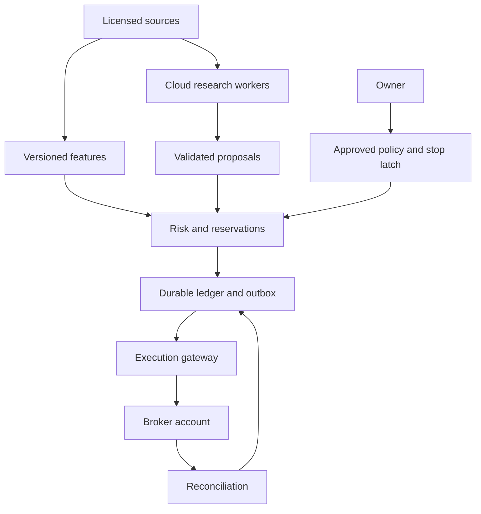
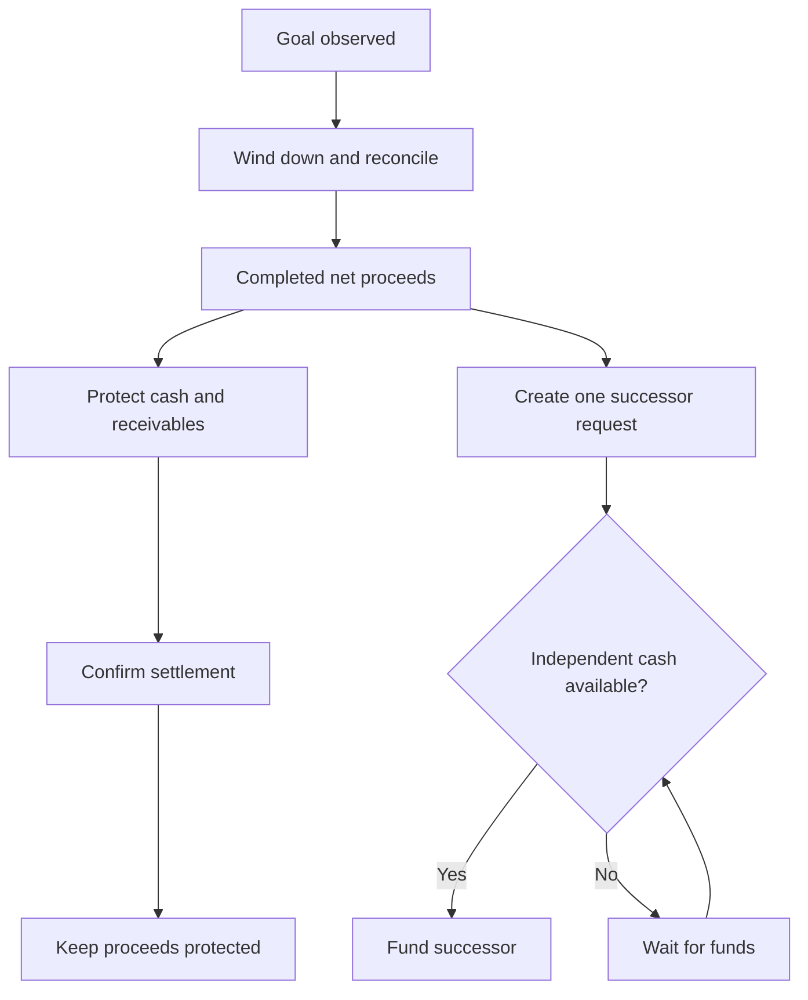

# Authority and session flows

These diagrams correspond to the publication figures. The book build renders publication versions using Matplotlib.

```mermaid
flowchart TD
    D[Licensed sources] --> F[Versioned features]
    D --> A[Cloud research workers]
    A --> P[Validated proposals]
    O[Owner] --> C[Approved policy and stop latch]
    F --> R[Risk and reservations]
    P --> R
    C --> R
    R --> L[Durable ledger and outbox]
    L --> G[Execution gateway]
    G --> B[Broker account]
    B --> X[Reconciliation]
    X --> L
```

```mermaid
flowchart TD
    T[Goal observed] --> W[Wind down and reconcile]
    W --> C[Completed net proceeds]
    C --> P[Protect cash and receivables]
    P --> S[Confirm settlement]
    S --> K[Keep proceeds protected]
    C --> N[Create one successor request]
    N --> F{Independent cash available?}
    F -->|Yes| R[Fund successor]
    F -->|No| Q[Wait for funds]
    Q --> F
```
